# 🚀 React Docker CI/CD Pipeline

A production-style DevOps project demonstrating the complete software delivery lifecycle for a React application using **Docker**, **GitHub Actions**, and **AWS**.

The project implements a complete **Continuous Integration (CI)** and **Continuous Deployment (CD)** pipeline that automatically:

* Builds the application
* Runs tests inside Docker
* Creates a deployment artifact
* Uploads the artifact to Amazon S3
* Deploys the application to an AWS EC2 instance
* Runs the production application inside a Docker container using Docker Compose

---

# 📖 Project Overview

This project demonstrates modern DevOps practices by separating the application into two environments:

* **Development Environment**

  * Dockerfile.dev
  * Docker Compose (Development)
  * Hot Reload
  * Dockerized Testing

* **Production Environment**

  * Production Dockerfile
  * Docker Compose (Production)
  * Nginx Container
  * Automated Deployment via GitHub Actions

---

# 🏗️ Architecture

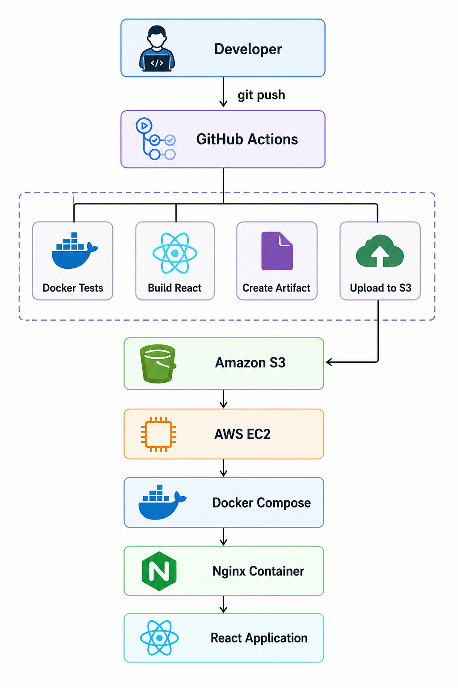

---

# ⚙️ Technologies Used

* React
* Docker
* Docker Compose
* GitHub Actions
* Jenkins
* Amazon EC2
* Amazon S3
* AWS IAM
* AWS CLI
* Ubuntu Server
* Nginx
* Node.js

---

# 📂 Project Structure

```text
.
├── .github/
│   └── workflows/
│       └── deploy.yml
├── build/
├── public/
├── src/
├── Dockerfile
├── Dockerfile.dev
├── docker-compose.dev.yml
├── docker-compose.prod.yml
├── package.json
├── package-lock.json
├── README.md
└── images/
```

---

# 💻 Development Environment

The development environment uses:

* Dockerfile.dev
* docker-compose.dev.yml

Features:

* Live Reload
* Bind Mounts
* Dockerized React Development Server
* Dockerized Testing

Start the development environment:

```bash
docker compose -f docker-compose.dev.yml up
```

---

# 🚀 Production Environment

The production deployment uses:

* Dockerfile
* docker-compose.prod.yml

The React application is built by GitHub Actions.

The production Docker image contains only:

* Nginx
* React production build

No Node.js runtime exists inside the production container.

---

# 🔄 CI/CD Pipeline

## Continuous Integration

Two CI solutions were implemented during this project:

### Jenkins (Local CI)

The Jenkins pipeline demonstrates local CI by:

1. Building the development Docker image
2. Running React tests inside Docker

### GitHub Actions (Cloud CI)

GitHub Actions performs:

1. Checkout Repository
2. Build Development Docker Image
3. Run React Tests inside Docker
4. Install Dependencies
5. Build Production React Files
6. Create Deployment Artifact

## Continuous Deployment

After a successful build:

1. Configure AWS Credentials
2. Upload Deployment Artifact to Amazon S3
3. SSH into AWS EC2
4. Download Deployment Artifact
5. Extract Deployment Package
6. Build Production Docker Image
7. Deploy using Docker Compose
8. Launch the Nginx Container

---

# ☁️ AWS Infrastructure

AWS Services used:

* Amazon EC2
* Amazon S3
* AWS IAM

The EC2 instance uses an **IAM Role** to securely access Amazon S3 without storing AWS credentials on the server.

GitHub Actions authenticates to AWS using GitHub Secrets.

---

# 📦 Deployment Artifact

GitHub Actions generates the deployment artifact:

```text
deploy.zip
│
├── build/
├── Dockerfile
└── docker-compose.prod.yml
```

The EC2 instance downloads the artifact from Amazon S3 and builds the production Docker image locally.

---

# 🐳 Docker Overview

## Development

* Dockerfile.dev
* Docker Compose Development
* React Development Server
* Dockerized Testing

## Production

* Dockerfile
* Docker Compose Production
* Nginx Container
* React Production Build

---

# 📸 Project Screenshots

## Architecture


---

## Local React Application

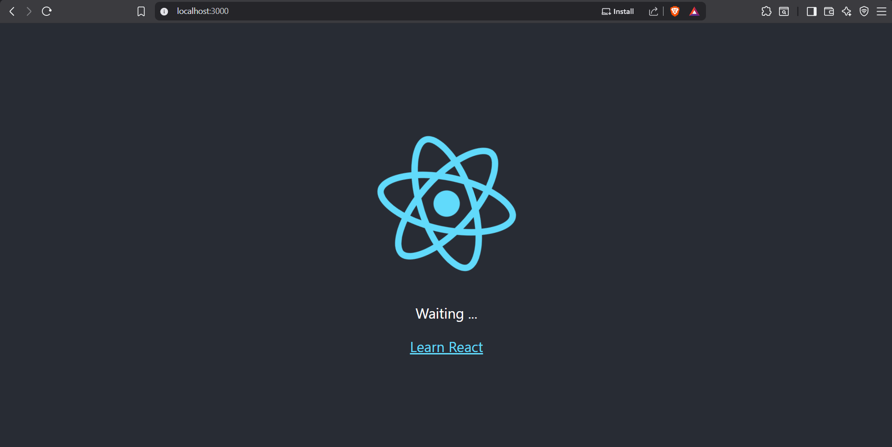

---

## Docker Images

Shows the development and production Docker images.

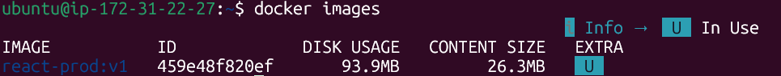

---

## Docker Compose (Development)

Development environment running with Docker Compose.

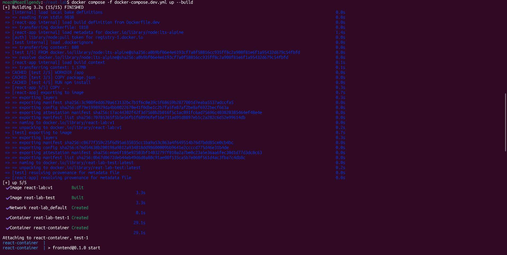

---

## GitHub Repository

Repository structure and project files.

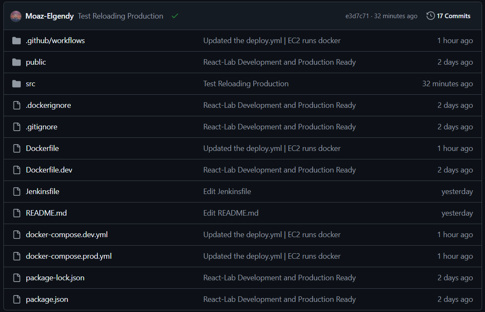

---

## GitHub Actions CI/CD Pipeline

Successful CI/CD workflow execution.

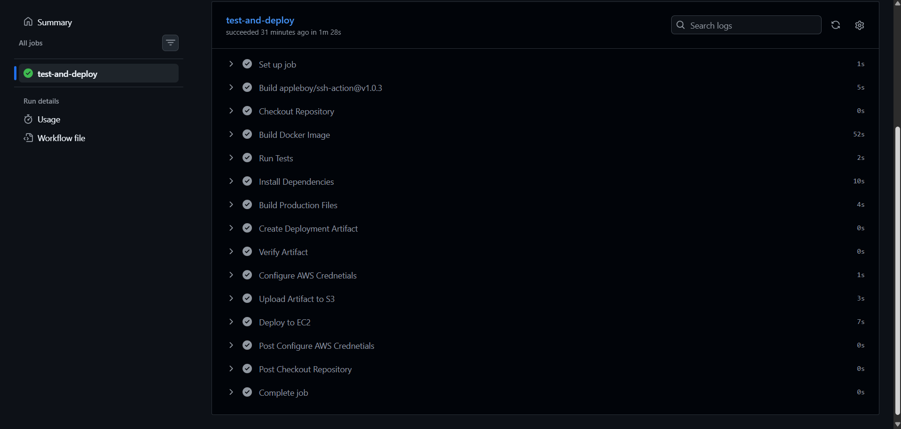

---

## Jenkins Pipeline

Successful Jenkins build running locally.

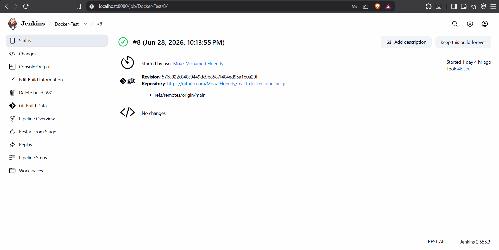

---

## Amazon S3 Deployment Artifact

Deployment artifact uploaded successfully.

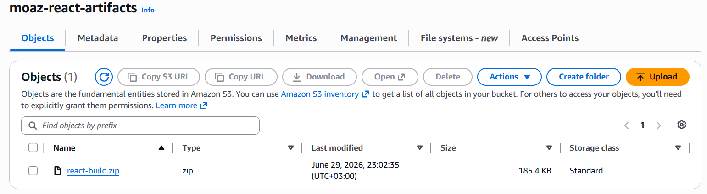

---

## AWS EC2 Instance

Running Ubuntu EC2 instance.

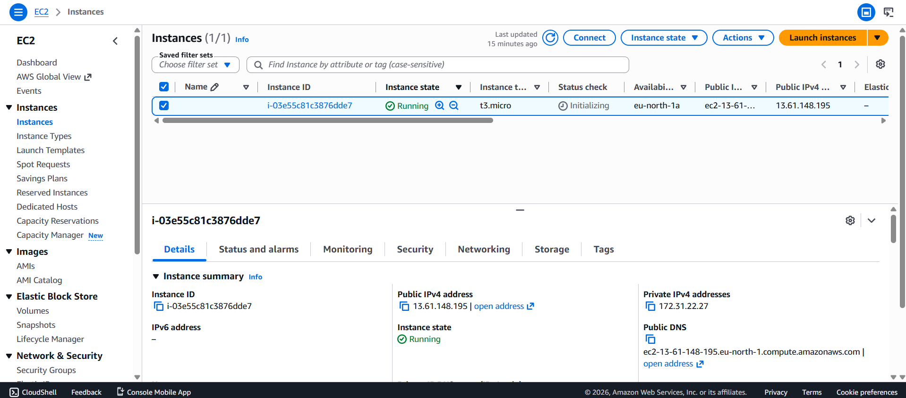

---

## Security Group Configuration

Inbound rules allowing SSH and HTTP traffic.

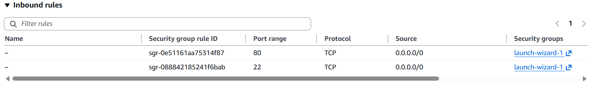

---

## IAM Role

EC2 IAM Role with Amazon S3 permissions.

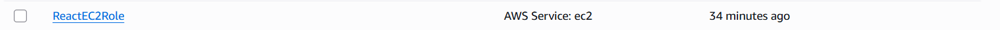

---

## Docker Running on EC2

Production container running on the EC2 instance.

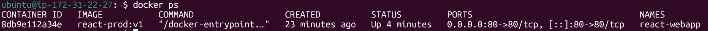

---

## Docker Compose on EC2

Docker Compose managing the production deployment.

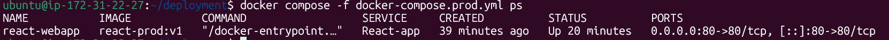

---

## Deployment Success

Successful deployment logs from GitHub Actions.

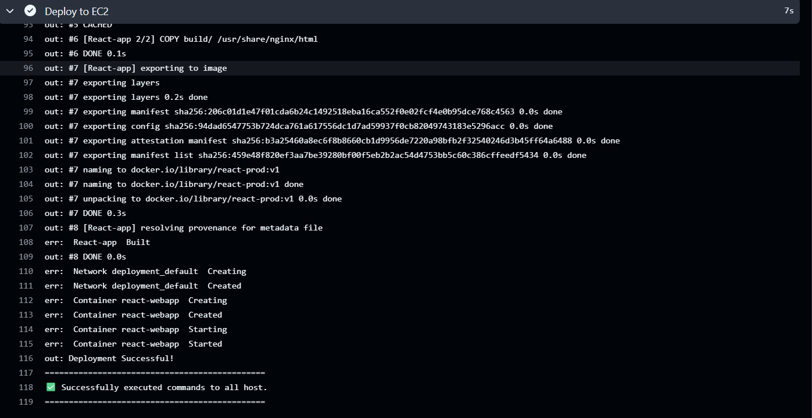

---

## Production Website

React application running from the AWS EC2 Public IP.

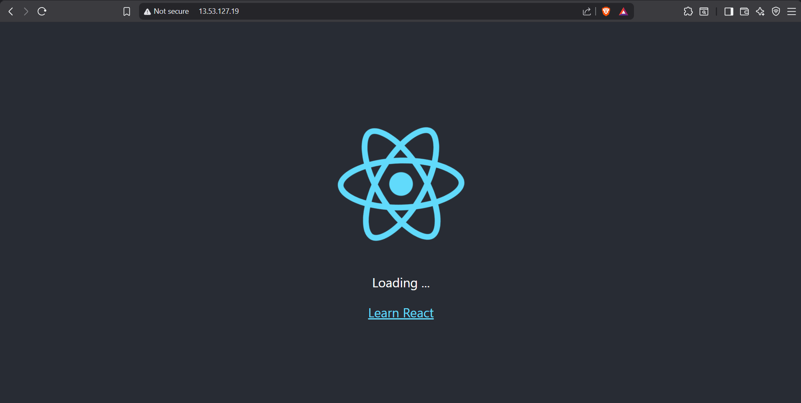

---

# 🎯 Learning Outcomes

This project demonstrates:

* Dockerizing React Applications
* Multi-Stage Docker Workflow
* Docker Compose
* GitHub Actions CI/CD
* Jenkins Pipelines CI
* Automated Testing
* Deployment Artifacts
* Amazon S3
* Amazon EC2
* AWS IAM Roles
* AWS CLI
* SSH Automation
* Containerized Production Deployment
* Nginx Web Server
* Infrastructure Automation

---

# 🔮 Future Improvements

* GitHub OIDC Authentication
* Docker Hub Deployment Strategy
* Terraform Infrastructure as Code
* Kubernetes Deployment
* HTTPS with Let's Encrypt
* Custom Domain with Route 53
* Blue/Green Deployment Strategy

---

# 👨‍💻 Author

**Moaz Mohamed**

DevOps Portfolio Project
